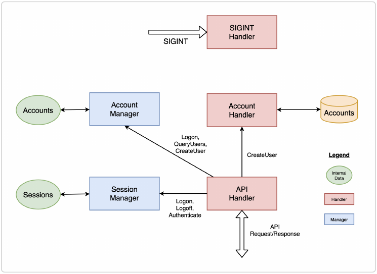

Add spago bash completion:
```shell
source <(spago --bash-completion-script $(which spago))
```

Automatic rebuild:
```shell
spago build --watch
```

### Directory Structure:
Data modelling means to define data types and corresponding Json types.  
- [**Entity**](https://github.com/mkohlhaas/Functional-Programming-Made-Easier/tree/ch-28/src/Entity)  
  Data modelling for sessions, accounts, users.
- [**Handler**](https://github.com/mkohlhaas/Functional-Programming-Made-Easier/tree/ch-28/src/Handler)  
  Handlers for communicating with the outside world: file, http, ...
- [**Data**](https://github.com/mkohlhaas/Functional-Programming-Made-Easier/tree/ch-28/src/Data/Api)  
  Data modelling for what's going over the wire via http.  
  Used by handlers.  
  Request → Response.  
  → create user, logon user, logoff user, query user.
- [**Parser**](https://github.com/mkohlhaas/Functional-Programming-Made-Easier/tree/ch-28/src/Parser)  
  Parses account from CSV file.
- [**Manager**](https://github.com/mkohlhaas/Functional-Programming-Made-Easier/tree/ch-28/src/Manager)  
  Managers for sessions and accounts  
  → verify sessions/accounts, create sessions/accounts, ...

### Server Architecture:



The difference between a __Handler__ and a __Manager__ is whether it interfaces to the outside world or not.
